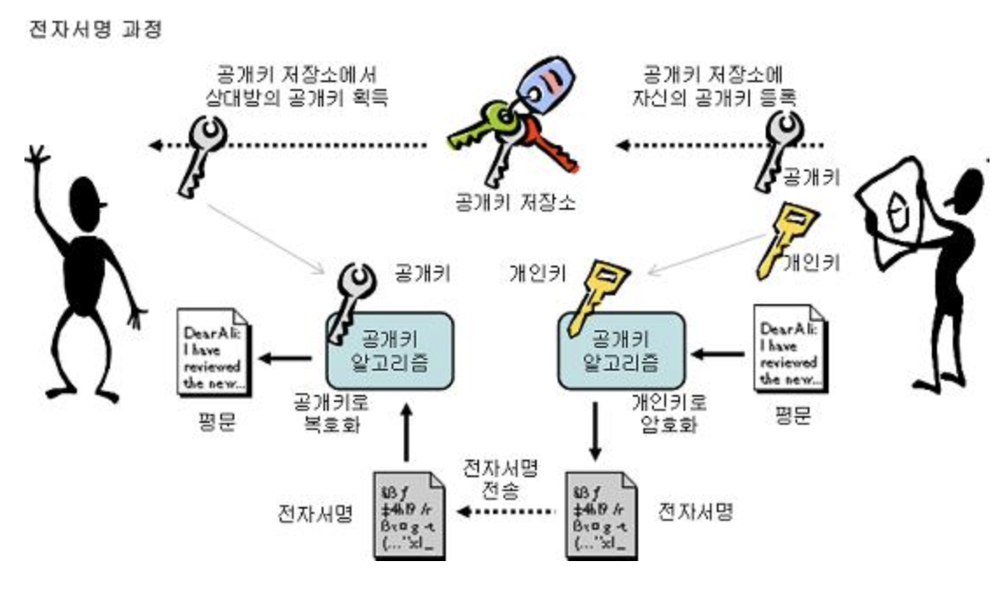

암호화
======

암호화 알고리즘은 수학적 과정을 통해 어떤 정보를 의미 없는 문자의 나열로(이진수 덩어리) 바꾸는 것

1 . 용어
--------

-	평문 (PlainText) : 누구나 쉽게 이해할 수 있는 데이터
-	암호문 (CipherText) : 승인 받지 않은 제3자가 이핼할 수 없는 데이터 형태
-	암호화 (Encryption) : 평문을 암호문으로 변환하는 과정
-	복호화 (Decryption) : 암호문을 평문으로 환원하는 과정
-	암호화/복호화 알고리즘 (algorithm) : 암호화/복호화에 사용되는 수학적 원리(수학함수)
-	키 (Key) : 암호화/복호화 알고리즘의 파라미터
-	혼돈 (Confusion) : 키와 암호문과의 관계를 감추는 성질, 암호문을 보고 키를 알아서는 안된다
-	확산 (Diffusion) : 평문과 암호문과의 관계를 감추는 성징, 암호문을 보고 평문을 알아서는 안된다

2 . 암호화 방식
---------------

### 2-1. 단방향 암호화

-	암호화만 가능하며 복호화는 불가능한 암호화 기법. (주로 패스워드에 사용된다)

### 2-2. 양방향 암호화

#### 2-2-1. 대칭키


1.	설명
	-	암호화 키와 복호화 키가 같은 방식 (암호화키 = 복호화키)
	-	통신 쌍방간에 항상 같은 키를 공유하고 있어야함
	-	대칭키는 새션마다 생성되며 이후 통신에는 유효하지 않음
2.	장점
	-	암호화 및 복호화가 빠르다
	-	데이터 전송이 적다
	-	다양한 암호화 기법이 존재
3.	단점
	-	확장성 : 100명의 사용자가 서로 대화를 나눈다고 가정하였을 때 안전한 통신 채널 형성을 위해 사용자는 99개의 서로 다른 키가 필요
	-	키 분배 : 암호문 전송 도중 공격자가 키를 가로채면 앞으로의 암호문을 해독할 수 있다
4.	키의 명칭
	-	대칭키(symmetric key, single key)
	-	비밀키(secret key)
	-	SSL의 경우 세션키(session key)

A가 메시지를 보내려고 대칭키를 사용한 암호문을 B에게 보내고 B가 암호문을 받았을 때 동일한 대칭키를 사용하여 암호문을 해독한다

#### 2-2-2. 공개키 (비대칭키)


1.	설명
	-	암호화 키와 복호화 키가 다른 방식
	-	공개키로 암호화한 데이터는 짝이 되는 개인키로만 복호화 가능
	-	개인키로 암호화한 데이터는 짝이 되는 공개키로 복호화 가능
2.	장점
	-	모든 Client가 데이터 전달을 위해 오직 한 쌍의 공개,개인를 갖고 있어 대칭키-확장성 문제 해결
	-	수신자의 공개키로 암호화한 세션키로 인해 대칭키-키분배 문제 해결
3.	단점
	-	암호화 및 복호화가 느리다(대칭형에 비해 약 1000배)
	-	많은 양의 자료를 암호화,복호화 하기 불편
	-	인증 : A,B Client가 대화 중 공격자가 A로 위장할 경우 B는 잘못된 통신을 할 수 있다.
	-	데이터 무결성 : 데이터 전송 중 메시지가 변경될 수 있다.
4.	키의 명칭
	-	비대칭키 쌍 (asymmetric key pair)
	-	공개키(Public key) : 타인에게 공개되는 키로 전자서명 검증키로 사용됨
	-	개인키(Private key) : 유일하게 본인만이 소유하는 키로써 전자서명 생성키로 사용됨

모든 Client는 공용키와 개인키를 한쌍씩 갖고 있다.<br> 공개키는 모두가 알고 있고 사용가능하고 개인키는 각 Client가 갖고 있다.<br>A가 B에게 암호문을 보내기 위해서 A는 우선 대칭 세션키를 생성한 후 B의 공개키로 암호화하여 해당 암호문을 B에게 보내면 B는 이에 상응하는 개인키를 갖고 있으므로 해당 암호문을 해독하고 세션키를 얻을 수 있다.<br> 해당 세션키는 A와 B사이의 암호문을 해독하는데 사용한다.

#### 2-2-3. 전자서명 & 인증서

1.	전자서명

	-	비대칭키 방식에서 공개키와 개인키의 위치가 바뀌면 전자서명이다.

	

2.	인증서

	-	전자서명만으로는 데이터 생성자, 즉 공개키 소유자의 실제 신원을 증빙할 수 없는데 공개키,개인키 소유자의 신원을 보증하기 위해 나타난 개념.
	-	공개키 암호화 방식의 인증 부분의 문제 해결

3 . AES ( Advanced Encryption Standard )
----------------------------------------

-	평문을 블록 단위로 암호화하는 대칭키 암호 방식
-	블록 사이즈 : 128 bit ( 고정 )

| Key     | key size (bit) | Round Count |
|:-------:|:--------------:|:-----------:|
| AES-128 |      128       |     10      |
| AES-192 |      192       |     12      |
| AES-256 |      256       |     14      |


#### 3-1. 패딩

주어진 평문을 블록 암호로 암호화하기 위해서는 평문을 우선 블록 크기의 배수로 만들어야 한다.<br>이때 평문의 길이가 블록 크기의 배수가 아닌 경우, 블록 크기의 배수가 되게끔 마지막 빈 공간을 채워 하나의 환전한 블록으로 만드는 작업.

1.	제로 패딩 (Zero Padding, Null Padding)

	-	패딩이 필요한 부분을 0으로 채운다.
	-	패딩의 크기를 알 수 없기 때문에 사용하지 않는다. ( 메시지 끝 부분에 0이 포함되어 있을 수 있다 )

	

2.	비트 패딩 (Bit Padding)

	-	패딩이 필요한 부분은 0으로 채우되, 최상위 비트는 1로 채운다.
	-	최상위 바이트는 16진수로 80이 된다. (2진수로는 1000 0000)

		

3.	바이트 패딩 (Byte Padding)

	

4.	PKCS7, PKCS5 패딩

	-	패딩 바이트 값을 패딩 바이트 크기로 사용한다

		

	-	두번째 그림에서 10은 16진수이다. 즉 10진수의 16을 의미한다.

	-	PKCS5 vs PKCS7

		-	PKCS5 : 바이트 블럭이 8바이트 고정일 경우
		-	PKCS7 : 바이트 블럭이 1~255 바이트(가변적)

#### 3-2. 운영 방식 (mode of operation)

패딩을 통해 주어진 평문을 블록 크기의 배수로 만든 후 평문을 암호화하는 방식<br> 블록 단위 : ECB, CBC, CTR<br> 스트림(비트) 단위 : CFB, OFB

1.	ECB(Electronic Code Block) 모드

	-	각 블록을 독립적으로 암호화하는 방식 (병렬 가능)

	

	-	단점

		-	키가 고정되어 있을 경우 평문이 동일한 블록은 암호화 결과도 동일

		

		-	블록 재사용(Block Replay) 가능<br>Replay Attack 예시

		

2.	CBC(Cipher Block Chaining) 모드

	-	평문의 각 블록은 XOR 연산을 통해 이전 블록과 연산되고 첫번째 블록에 대해서는 IV(Initial Vector:초기백터)가 암호문 대신 사용된다.<br>IV : 동일한 평문,키에서 매번 다른 암호화 결과를 내도록 하기 위해 사용
	-	병렬 불가능, 순차적

	

	-	단점

		-	IV의 Bit를 조작해 특정 블록의 비트를 변경하는 공격 가능<br>CBC Bit-flipping Attack 예시

		

		-	데이터 값이 변하여 전달되면 이것이 변경된 데이터인지 검증할 수 없다

3.	CTR(CounTeR) 모드

	-	블록을 암호화할 때마다 1씩 증가하는 카운터를 암호화하여 키스트림을 만든다. 즉 카운터를 암호화한 비트열과 평문블록과의 XOR을 취한 결과가 암호문 블록이 된다
	-	병렬처리 가능 : 블록의 순서를 임의로 암/복호화 가능 (블록번호로부터 카운터를 구할수 있어서)
	-	Nonce : IV 값이 난수 ( 한번의 암호화만 사용 )

	

4.	GCM(Galois/Counter Mode)

	-	CTR + 인증
	-	데이터 값의 HASH가 암호문에 포함되어 있어 복호화시 실제 그 데이터가 맞는지 검증하는 역할이 추가됨(데이터 변조 시 확인 가능) - 무결성 검증

5.	CFB(Cipher FeedBack), OFB(Output FeddBack) 모드 - (정확히 이해 X)

	-	블록 암호화를 스트림 암호화처럼 구성하여 평문과 암호문의 길이가 같다 (패딩이 필요가 없다)
	-	초기화 백터를 암호화 한 후 평문과 XOR 연산
	-	암호화와 복호화의 방식이 동일하여 암호문을 한번 더 암호화하면 평문이 나옴(복호화시에 암호화를 진행)

	-	CFB vs OFB

	

	

4 . RSA ( Rivest, Shamir, Adleman )
-----------------------------------

-	암호화뿐만 아니라 전자서명이 가능한 공개키 암호화 시스템.
-	자리 수가 많은 양의 정수에 대한 소인수 분해가 어렵다는 것에 착안 하여 이를 수학적으로 구현한 비대칭 알고리즘.
-	SSL, TLS에 가장 많이 사용되고 있다 - 인터넷에서의 정보를 암호화하여 송수신하는 프로토콜

	-	SSL ( Secure Socket layer ) 프로토콜

		1.	사이트에서 인증기관(CA:Certificate Authority)에 사이트정보와 공개키를 제출하여 인증 요청
		2.	인증기관에서 검증 후 사이트의 공개키와 정보를 인증기관의 개인키로 암호화하여 사이트 인증서 제작하여 사이트로 인증서 발급
		3.	인증기관의 공개키는 브라우저에 제공하고 이 공개키는 브라우저에 내장됨
		4.	사용자는 사이트로 접속요청을 하고 사이트는 발급받은 인증서를 사용자에게 전달
		5.	사용자는 브라우저에 내장된 공개키로 인증서를 복호화하여 사이트의 정보와 공개키 획득 -> 사이트의 공개키로 대칭키(마스터키)를 암호화하여 전송
		6.	사이트는 전송 받은 암호화된 대칭키를 사이트의 개인키로 복호화 -> 사용자, 사이트 같은 대칭키 획득
		7.	전송 시 해당 대칭키로 암호화하여 전송

		

	-	TLS ( Transport Layer Security Protocol )

		SSL이 국제 표준으로 승격되면서 TLS라는 명칭으로 변경.

5 . Jetpack Security
--------------------

-	암호화 관련 : EncryptedSharedPreferences, EncryptedFile

1.기존 암호화 방식

```kotlin
val KEY:String = "63e2c0aa89c5cb1055c0ce867ec358ac"
val KEY_256 = KEY.substring(0, 256/8) // 64
val KEY_128 = KEY.substring(0, 128/8) // 32
val keySpec = SecretKeySpec(KEY_256.toByteArray(), "AES")
val ivSpec = IvParameterSpec(KEY_128.toByteArray())
val cipher = Cipher.getInstance("AES/CBC/PKCS7Padding")

// 암호화
val plainText = "동해물과 백두산이 마르고 닳도록 하나님이 보우하사 우리나라만세"
cipher.init(Cipher.ENCRYPT_MODE, keySpec, ivSpec)
val encrypted = cipher.doFinal(plainText.toByteArray())
val encodeByte = Base64.encode(encrypted, Base64.DEFAULT)

// 복호화
val decodeByte:ByteArray = Base64.decode(encodeByte, Base64.DEFAULT)
cipher.init(Cipher.DECRYPT_MODE, keySpec, ivSpec)
val decrypted = cipher.doFinal(decodeByte)
```

2.EncryptedSharedPreferences

```kotlin
// 마스터키(대칭키) 생성
val keyGenParameterSpec = MasterKeys.AES256_GCM_SPEC
val masterKeyAlias = MasterKeys.getOrCreate(keyGenParameterSpec)

val sharedPreferences = EncryptedSharedPreferences.create(
    "sharedPreferenceDbFileName",
    masterKeyAlias,
    Context,
// SIV(System Integrity Verifier) 시스템 무결성 검증기
    EncryptedSharedPreferences.PrefKeyEncryptionScheme.AES256_SIV,
    EncryptedSharedPreferences.PrefValueEncryptionScheme.AES256_GCM
)
val spfEditor: SharedPreferences.Editor = sharedPreferences.edit()
```

3.EncryptedFile

```kotlin
// 파일 쓰기
val keyGenParameterSpec = MasterKeys.AES256_GCM_SPEC
val masterKeyAlias = MasterKeys.getOrCreate(keyGenParameterSpec)

val fileToWrite = "enc_file_test.txt"
val encryptedFile = EncryptedFile.Builder(
	File(폴더 경로, fileToWrite),
	Context,
	masterKeyAlias,
	EncryptedFile.FileEncryptionScheme.AES256_GCM_HKDF_4KB
).build()

encryptedFile.openFileOutput().use { fileOutputStream ->
	fileOutputStream.write("암호화할 텍스트파일 내용".toByteArray())
}
```

```kotlin
// 파일 읽기
val keyGenParameterSpec = MasterKeys.AES256_GCM_SPEC
val masterKeyAlias = MasterKeys.getOrCreate(keyGenParameterSpec)

val fileToRead = "enc_file_test.txt"
val encryptedFile = EncryptedFile.Builder(
	File(폴더 경로, fileToRead),
	Context,
	masterKeyAlias,
	EncryptedFile.FileEncryptionScheme.AES256_GCM_HKDF_4KB
).build()

encryptedFile.openFileInput().use { fileInputStream ->
	val byteStream = ByteArrayOutputStream()
	var nextByte = fileInputStream.read()
	while(nextByte != -1){
		byteStream.write(nextByte)
		nextByte = fileInputStream.read()
	}
	val fileContents = byteStream.toByteArray()
	fileInputStream.close()
}
```

<br><br><br><br><br><br><br><br><br><br><br><br><br><br><br><br><br><br>
